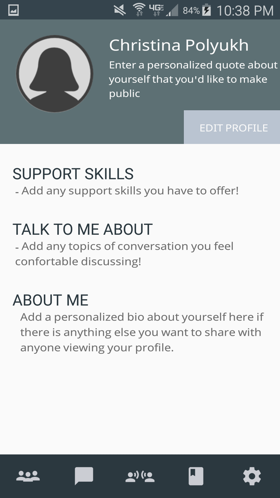

# 

Depression acts as one of the leading mental health diagnostics affecting college-aged students today. But with a societal stigma surrounding mental health and barriers to therapy, it is difficult for students to receive the support that they need to better manage their depressive state. Trellis is a mobile application that supports students by encouraging thoughtful, caring conversations and education about depression. Trellis is designed to connect those that want to get support, to those that want to give support.

## Key Features / Screenshots

### Login Page
### 
Login with Facebook for easy setup, streamlining your user experience. By connecting with your Facebook account, you can view Facebook friends who are using the application to build deeper relationships. If you don’t know if you want to create an account yet, feel free to browse through the application and view main features by continuing as guest. 

### Welcome Page
### 
Set up your profile type on this welcome page to allow Trellis to work to its full potential. Choose whether you are seeking support, or if you want to give support to someone struggling with symptoms of depression. 

### Support (Giving Support)
### 
There are two views for the “Support” screen depending on whether a user chooses to give support using the app, or get support. Those that choose to give support will be able to see a running list of all the friends they are actively trying to support. It also shows them how long they’ve been helping someone.

### Support (Receiving Support)
### 
For those that choose to get support, they are shown a different view that allows them to filter between all of the possible supporters they can choose on the app, and those that they’ve actually started a dialogue with. This view allows users to see how many other people someone is supporting. But both views also include a user’s quote that will allow others to more easily understand where they’re coming from.

### Messages 
### 
This is a standard messaging application. Users (supporters and supportees) can message each other.

### Message
### 
Chat with your supporter or supportee and develop your relationship. 

### Conversation Starters
### 
Sometimes, it’s hard to talk with someone about their depression. The default conversation starters that show up on the initial page are your top used conversation starters.

### 
This feature allows users to select from a list of questions ordered by different topics to help start the conversation, and move their relationship forward. 

### Learn More
### 
This is a static page that includes a list of curated articles based off of what users wanted to know more about themselves, and what they wanted others to know about depression. It’s meant to help disseminate information and educate all users of the application.

### Settings
### 
The settings page allows someone to edit their profile, as well as set whether they’re anonymous (but only if they are seeking support).

## Contributers 
####Team TECK
**T**amanh Nguyen -> Designer
**E**den Ghirmai -> Developer
**C**hristina Polyukh -> Developer
**K**risten Wei -> Project Manager / Designer 

